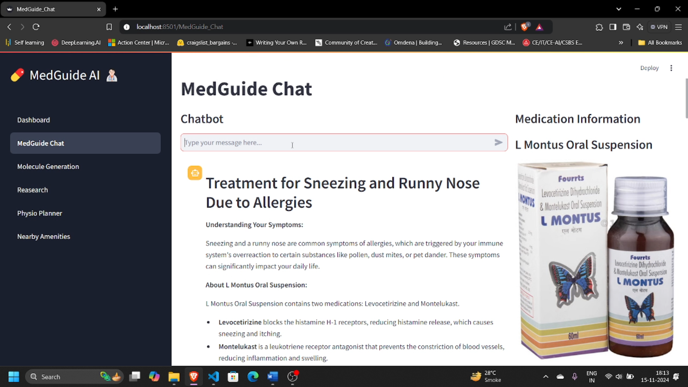

# MedGuide AI Dashboard

MedGuide AI is a **Streamlit-based application** integrating multiple healthcare modules to provide a versatile tool for medical information retrieval, molecular analysis, research support, and physiotherapy planning. It leverages **advanced language models**, **PubMed integration**, and a custom **FAISS index** for optimized medicine suggestions, including **Ayurvedic alternatives**.

---

## **Overview**

The MedGuide AI dashboard includes the following key features:

- **MedGuide Chat**: Provides reliable answers to medical queries using PubMed research articles and suggests Ayurvedic alternatives where available.
- **Molecule Generation**: Visualizes molecular structures for pharmaceutical research.
- **Research Support**: Retrieves top scientific articles from PubMed related to healthcare topics.
- **Physio Planner**: Offers custom physiotherapy plans tailored to users' health conditions.
- **MediScan**: Allows users to upload a medicine image and receive detailed information about it.

---

## **1. MedGuide Chat**

MedGuide Chat serves as an interactive healthcare assistant, offering comprehensive information about medications, symptoms, and related topics. It integrates **PubMed resources** and language models to deliver accurate responses.

### **Features**

#### **1.1 Interactive Chatbot**

- **Conversational Interface**: Users can type medical questions and receive detailed answers.
- **Medicine-Specific Information**: Provides data about:
  - Uses
  - Composition
  - Side effects
  - Manufacturer
- **Alternative Options**: Suggests alternative medicines with accompanying images.
- **Downloadable Reports**: Generates PDF reports containing medication details.

#### **1.2 Medication Information Panel**

  

- **Primary Medicine Details**: Comprehensive insights into the queried medication, including usage, side effects, and more.
- **Alternative Medicines**: Displays options for similar medications, empowering users with choices.

#### **1.3 Healthcare Source Search**

- **HealthcareSearchAgent**: Fetches URLs and summaries from relevant medical articles for further reading and verification.

---

## **2. Molecule Generation**

A feature aimed at pharmaceutical research and drug discovery, allowing users to visualize molecular structures.

- **SMILES Notation Input**: Converts molecular names into visual chemical structures.
- **Application in Research**: Facilitates the design and understanding of new pharmaceutical compounds.
- **Powered by**: 
  - **Groq API** for accelerated computations.
  - **RDKit** for chemical structure visualization.

---

## **3. Research Support**

This module integrates with PubMed to fetch top scientific articles relevant to healthcare topics.

- **Efficient Article Retrieval**: Extracts and summarizes research findings using the PubMed API.
- **Research Validation**: Supports evidence-based practices by providing access to verified medical studies.
- **User Benefits**: A valuable resource for medical professionals, researchers, and students.

---

## **4. Physio Planner**

An intelligent physiotherapy planning system tailored to user-specific health conditions.

- **Custom Recommendations**: Generates exercise and rehabilitation plans based on user inputs.
- **Dynamic Adjustments**: Incorporates feedback to refine plans over time.
- **User-Friendly Design**: Helps users improve their physical health with personalized guidance.

---

## **5. MediScan**

MediScan allows users to upload images of medicines and retrieve detailed information, such as:

- Name, composition, and manufacturer.
- Usage instructions and possible side effects.
- Ayurvedic or alternative medicine options.

---

## **Technology Stack**

### **Frontend**
- **Streamlit**: Provides an intuitive and responsive web interface.

### **Backend**

- **Python**: Handles backend logic, including data processing and API calls.

### **Utilities**
- **RDKit**: For managing chemical structures in molecular generation.
- **PubMed API**: Fetches scientific research articles.
- **Custom Libraries**:
  - `pubmed_utils`: For retrieving PubMed articles.
  - `medicine_utils`: Searches for medication details and alternatives.
  - `pdf_utils`: Generates downloadable PDF reports.
  - `llm_chain`: Powers the chatbot responses using language models.

---

MedGuide AI provides a holistic healthcare solution, blending advanced AI technologies with practical healthcare applications to serve patients, professionals, and researchers alike.
